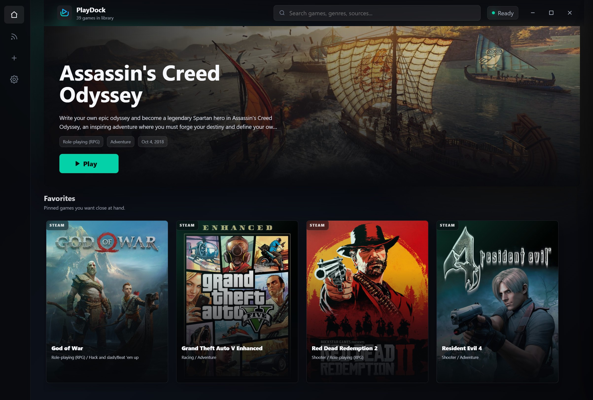
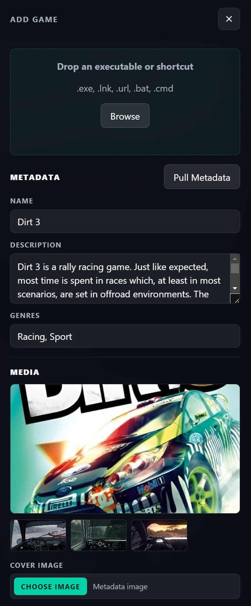
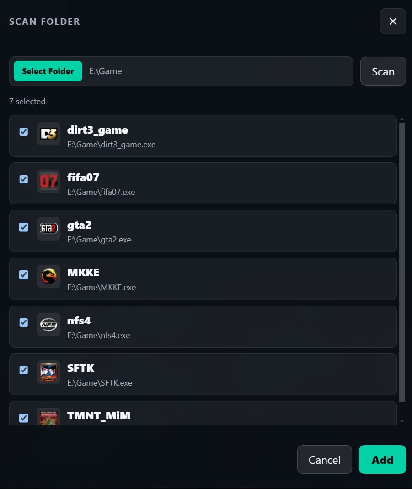
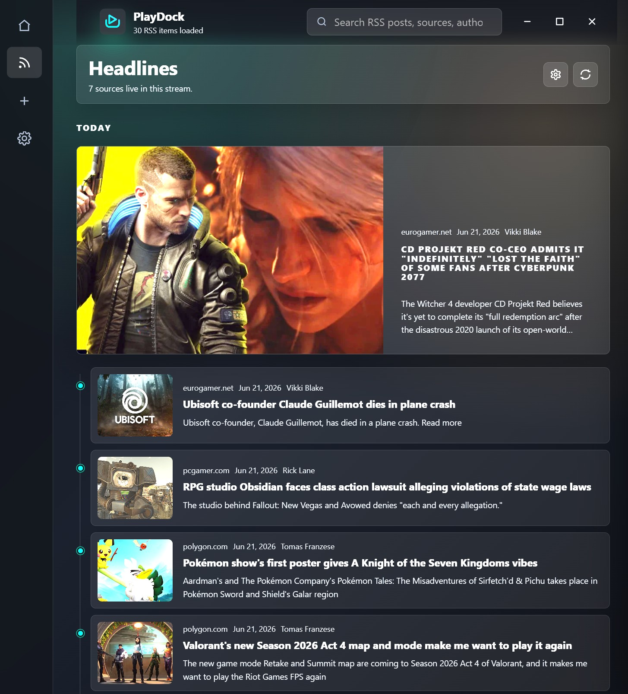

# PlayDock



PlayDock is a Windows desktop gaming hub for keeping PC games from different launchers in one clean library. It scans supported launchers, lets you add local games, launches games directly, enriches entries with IGDB metadata, and includes an RSS feed for gaming news.

## What It Does

PlayDock gives you one place to browse, search, organize, and launch your PC games.

- Scans installed games from supported launchers.
- Adds local games from executables, shortcuts, URLs, batch files, command files, or folder scans.
- Launches games directly from the library.
- Pulls game metadata from IGDB, including descriptions, covers, screenshots, genres, developers, publishers, scores, videos, and links.
- Shows gaming headlines from configurable RSS feeds.
- Tracks favorites, recent games, play count, playtime, hidden games, and local library details.
- Stores your library and app settings locally on your Windows device.

## Build

Requirements:

- Windows
- Node.js
- npm

Install dependencies:

```bash
npm install
```

Run the app in development:

```bash
npm start
```

Build package types:

```bash
npm run dist:portable
npm run dist:installer
npm run dist:msi
```

Build outputs are created in the `dist/` folder.

## Install

Download PlayDock from the [GitHub Releases page](https://github.com/firatkiral/playdock/releases).

### Portable Windows Build

Use the portable build if you want to run PlayDock without a full installer.

1. Download the portable Windows package from [GitHub Releases](https://github.com/firatkiral/playdock/releases), or build it locally.
2. Extract it if needed.
3. Run `PlayDock.exe`.

### Installer

Use the installer if you want PlayDock added to Windows like a normal desktop app.

1. Download the installer package from [GitHub Releases](https://github.com/firatkiral/playdock/releases), or build it locally.
2. Run the installer.
3. Launch PlayDock from the Start menu or desktop shortcut.

PlayDock currently builds Windows MSI and NSIS installer packages.

## Features

Game cards show the core actions you need often:

- Play a game directly from its card.
- Edit game details, launch options, metadata, and images.
- Mark games as favorites.
- Open game details with metadata, media, videos, and links.

Search helps filter the library by:

- Game name
- Genre
- Source, such as `steam`, `epic`, `gog`, `ubisoft`, or `local`
- Developer, publisher, and tags when metadata is available

The library is organized into sections:

- Continue Playing: recently launched games.
- Favorites: games you marked as favorites.
- Full Library: every visible game in your PlayDock library.

Supported launchers and sources:

- Steam
- Epic Games
- Ubisoft Connect
- GOG
- Local games and shortcuts

## Adding a Game



Open the add menu and choose **Add Game** to create a local game entry.

You can:

- Drag and drop an executable or shortcut into PlayDock.
- Browse for a game file.
- Edit the game name, description, and genres.
- Pull metadata from IGDB by searching for the game.
- Add or replace cover images.
- Add screenshots.
- Set the launch path, working directory, process name, and launch arguments.

After saving, the game appears in the library and can be launched like any other entry.

## Scanning Folder



Folder scanning helps add several local games at once.

1. Open the add menu.
2. Choose **Scan Folder**.
3. Select the folder you want PlayDock to inspect.
4. Choose the games you want from the scan results.
5. Add the selected games to your library.

After the games are added, use each card's edit action to update metadata, images, launch options, or other details.

## RSS Feed



PlayDock includes an RSS feed view for gaming news, videos, and updates.

The feed loads posts from the configured RSS URLs, groups recent items, shows source names and thumbnails when available, and opens articles externally when selected.

To add or change RSS URLs:

1. Open the RSS feed view.
2. Open RSS settings from the feed header.
3. Add one RSS URL per line.
4. Save the settings.

Default RSS sources are defined in `defaults.json`, and your changes are stored locally in PlayDock settings.

## Settings

### IGDB

PlayDock connects IGDB.com (Internet Game Database) for optional game metadata. To enable metadata search and automatic metadata loading, add your IGDB credentials in Settings.

Create IGDB credentials here: [IGDB account creation](https://api-docs.igdb.com/#account-creation)

Required values:

- Client ID
- Client Secret

You can test the connection from Settings before saving.

### App Settings

PlayDock includes these app options:

- Run on Startup: starts PlayDock when you sign in to Windows.
- Close to Tray: keeps PlayDock running in the system tray when the window is closed.
- Show Tips: keeps setup and onboarding tips visible.
- Add to Start: creates a Start menu shortcut.
- Desktop Shortcut: creates a desktop shortcut.

### Hidden Games

Games scanned from external sources such as Steam, Epic Games, Ubisoft Connect, and GOG cannot be deleted from inside PlayDock because those entries come from installed launcher data.

Instead, PlayDock lets you hide them from the library. Hidden launcher games can be restored later from Settings.

Local games that you manually added can be edited or deleted from PlayDock.

## Privacy

PlayDock stores your library, settings, RSS configuration, hidden games, and IGDB credentials locally on your Windows device.

Local app data is stored under:

```txt
C:\Users\[YourUsername]\AppData\Local\PlayDock
```
You can remove this folder to reset the app.

PlayDock does not collect or sell user data.

Network access is used only for app features such as:

- IGDB authentication and metadata lookup.
- IGDB image downloads for covers and screenshots.
- RSS feed loading.
- Opening external links you choose to open.

Your IGDB credentials are saved locally so PlayDock can request metadata. Do not share your local PlayDock database if you want to keep those credentials private.

## License

MIT License. See `LICENSE`.
